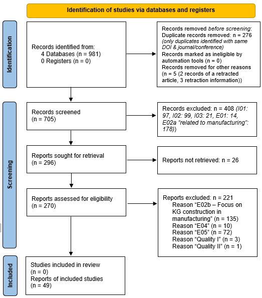

# Systematic Literature Review on Knowledge Graph Construction using NeuroSymbolic AI approaches on Manofacturing scenarios


[](https://opensource.org/licenses/MIT)


## Table of Contents
- [Systematic Literature Review on Knowledge Graph Construction using NeuroSymbolic AI approaches on Manofacturing scenarios](#systematic-literature-review-on-knowledge-graph-construction-using-neurosymbolic-ai-approaches-on-manofacturing-scenarios)
  - [Table of Contents](#table-of-contents)
  - [Overview](#overview)
  - [License](#license)
  - [Citations](#citations)
  - [Acknowledgments](#acknowledgments)
  - [Troublehshooting](#troublehshooting)

## Overview
This repository contains all the artefacts, data, and scripts related to the systematic literature review (SLR) on Knowlwdge Graph Construction using NeuroSymbolic AI focused on manofactiring use-cases. 

The main question to guide this review is “Which role play neuro-symbolic AI approaches in knowledge graph construction for Manufacturing?

From originally **981** obtained search results, **53** remained after applying inclusion and exclusing criteria during the screening process. Additional **four** reports were excluded based on quality criteria, thereof **three** because of a low ranking of the publishing venue. The remaining **49** reports result in **5%** of the overall search corpus. This is reasonable as the focus of *neuro-symbolic* approaches is not specified in our search query and a resulting lower precision is expected.

<p align="center">
  
</p>


## License

This project is licensed under the MIT License - see the [LICENSE](LICENSE) file for details.

## Citations 

If this work is with your interest you can read the associated [paper]() and if you use it in your research please don't forget to cite 👍 this work, the suggested citation in BibTex format is:

``` BibTex
@article{Schmidt2024,
author = {Schmidt, Wilma and Rincon-Yanez, Diego and Kharlamov, Evgeny and Paschke, Adrian},
journal = {Submited to Semantic Web Journal},
number = {TBD},
pages = {TBD},
title = {{Systematic Literature Review on Neuro-Symbolic AI in Knowledge Graph Construction for Manufacturing}},
volume = {TBD},
year = {2024}
}
```

## Acknowledgments

Acknowledge any contributors or organizations here.

## Troublehshooting

If there is any troubles or have any questions, please open an issue stating the encountered problem. Contributing is always welcome. The [Github repository Issues URL](https://github.com/wAIlma/SLR-NeSyAI-KGC/issues).  And contributing is always welcome. The [Github repository URL](https://github.com/wAIlma/SLR-NeSyAI-KGC).


Happy hacking!! 🖖🖖.