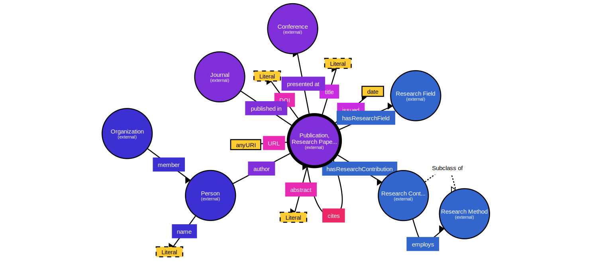

# Research Paper Ontology Schema for Systematic Literature Review

## Overview

This directory contains the ontology schema used for organizing and representing research papers in the systematic literature review (SLR) on [Topic]. The schema leverages the Bibliographic Ontology (BIBO), Citation Typing Ontology (CITO), Semantic Web for Research Communities (SWRC), and Open Research Knowledge Graph (ORKG) ontologies.

<p align="center">
  
</p>

## Features

By integrating BIBO, CITO, SWRC, and ORKG, this schema provides a comprehensive framework for describing research papers and their relationships. Here are the key features:

- **Rich Bibliographic Descriptions:** Using BIBO, the schema supports detailed descriptions of bibliographic resources such as journal articles, books, conference papers, and more.
- **Detailed Citation Relationships:** CITO enables the characterization of the nature of citations, distinguishing between types like agreement, disagreement, extension, and more.
- **Research Community Context:** SWRC includes terms for describing research entities such as researchers, organizations, and events, providing context for the bibliographic data.
- **Structured Research Contributions:** ORKG facilitates the representation of structured research information, including contributions, methods, results, and comparisons, enhancing the semantic richness of the data.

## Imported Ontologies 

- **BIBO (Bibliographic Ontology):** Provides a framework for describing bibliographic resources.
- **CITO (Citation Typing Ontology):** Facilitates the description of the nature or type of citations.
- **SWRC (Semantic Web for Research Communities):** Supports the description of academic research communities, including publications and researchers.
- **ORKG (Open Research Knowledge Graph):** Aids in representing structured information about research contributions.

### Namespaces

- `foaf`: <http://xmlns.com/foaf/0.1/>
- `bibo`: <http://purl.org/ontology/bibo/>
- `cito`: <http://purl.org/spar/cito/>
- `swrc`: <http://swrc.ontoware.org/ontology#>
- `orkg`: <http://orkg.org/core>

## Usage

You can use this ontology by importing ontology.rdf into your application. Also you can import  Ontology into your project using the following namespace:

```turtle
@prefix bibo: <http://purl.org/ontology/bibo/> .
@prefix cito: <http://purl.org/spar/cito/> .
@prefix dcterms: <http://purl.org/dc/terms/> .
@prefix foaf: <http://xmlns.com/foaf/0.1/> .
@prefix orkg: <http://orkg.org/core> .
@prefix owl: <http://www.w3.org/2002/07/owl#> .
@prefix rdfs: <http://www.w3.org/2000/01/rdf-schema#> .
@prefix swrc: <http://swrc.ontoware.org/ontology#> .
@prefix xsd: <http://www.w3.org/2001/XMLSchema#> .
```

**Documentation:**
   - Refer to `structure.md` for detailed explanations of each ontology component, their relationships, and examples of usage.


